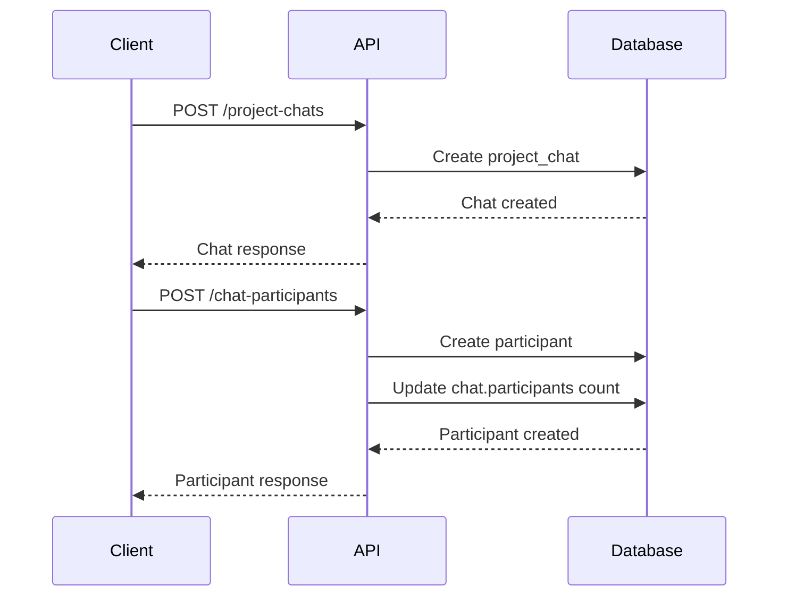
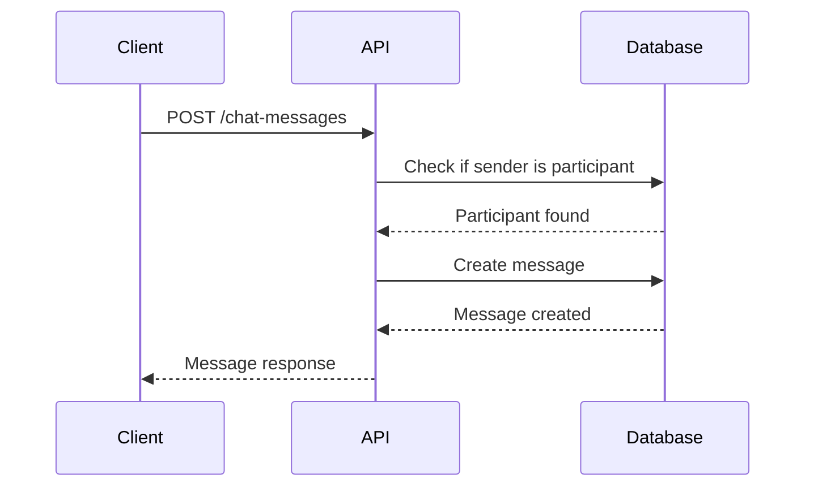
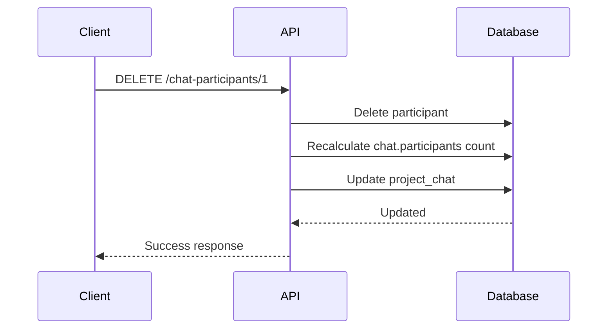

# Communication Module API Documentation

## Overview
The Communication Module provides comprehensive chat functionality for project-based communication, including project chats, chat participants management, and chat messages with robust authorization and validation.

## Table of Contents
1. [Project Chats](#project-chats)
2. [Chat Participants](#chat-participants)
3. [Chat Messages](#chat-messages)

---

## Project Chats

### Base URL: `/communication/project-chats`

### 1. Get All Project Chats
**GET** `/communication/project-chats`

**Response:**
```json
[
  {
    "id": 1,
    "projectId": 1,
    "participants": 3,
    "transferredFromEmployeeId": null,
    "transferredToEmployeeId": null,
    "createdAt": "2024-01-15T10:30:00Z",
    "updatedAt": "2024-01-15T10:30:00Z",
    "project": {
      "id": 1,
      "name": "E-commerce Platform",
      "status": "in_progress"
    },
    "transferredFromEmployee": null,
    "transferredToEmployee": null
  }
]
```

### 2. Get Project Chat by ID
**GET** `/communication/project-chats/:id`

**Response:**
```json
{
  "id": 1,
  "projectId": 1,
  "participants": 3,
  "transferredFromEmployeeId": null,
  "transferredToEmployeeId": null,
  "createdAt": "2024-01-15T10:30:00Z",
  "updatedAt": "2024-01-15T10:30:00Z",
  "project": {
    "id": 1,
    "name": "E-commerce Platform",
    "status": "in_progress"
  },
  "chatParticipants": [
    {
      "id": 1,
      "chatId": 1,
      "employeeId": 1,
      "memberType": "owner",
      "createdAt": "2024-01-15T10:30:00Z",
      "employee": {
        "id": 1,
        "firstName": "John",
        "lastName": "Doe",
        "email": "john.doe@company.com"
      }
    }
  ]
}
```

### 3. Create Project Chat
**POST** `/communication/project-chats`

**Request Body:**
```json
{
  "projectId": 1,
  "transferredFromEmployeeId": null,
  "transferredToEmployeeId": null
}
```

**Response:**
```json
{
  "message": "Project chat created successfully",
  "data": {
    "id": 1,
    "projectId": 1,
    "participants": 0,
    "transferredFromEmployeeId": null,
    "transferredToEmployeeId": null,
    "createdAt": "2024-01-15T10:30:00Z",
    "updatedAt": "2024-01-15T10:30:00Z"
  }
}
```

### 4. Update Project Chat
**PUT** `/communication/project-chats/:id`

**Request Body:**
```json
{
  "projectId": 2,
  "transferredFromEmployeeId": 1,
  "transferredToEmployeeId": 2
}
```

**Response:**
```json
{
  "message": "Project chat updated successfully",
  "data": {
    "id": 1,
    "projectId": 2,
    "participants": 3,
    "transferredFromEmployeeId": 1,
    "transferredToEmployeeId": 2,
    "createdAt": "2024-01-15T10:30:00Z",
    "updatedAt": "2024-01-15T11:00:00Z"
  }
}
```

### 5. Delete Project Chat
**DELETE** `/communication/project-chats/:id`

**Response:**
```json
{
  "message": "Project chat deleted successfully",
  "data": { "id": 1 }
}
```

---

## Chat Participants

### Base URL: `/communication/chat-participants`

### 1. Get All Chat Participants
**GET** `/communication/chat-participants`

**Response:**
```json
[
  {
    "id": 1,
    "chatId": 1,
    "employeeId": 1,
    "memberType": "owner",
    "createdAt": "2024-01-15T10:30:00Z",
    "employee": {
      "id": 1,
      "firstName": "John",
      "lastName": "Doe",
      "email": "john.doe@company.com",
      "department": {
        "id": 1,
        "name": "Development"
      },
      "role": {
        "id": 1,
        "name": "senior"
      }
    }
  }
]
```

### 2. Get Chat Participant by ID
**GET** `/communication/chat-participants/:id`

**Response:**
```json
{
  "id": 1,
  "chatId": 1,
  "employeeId": 1,
  "memberType": "owner",
  "createdAt": "2024-01-15T10:30:00Z",
  "employee": {
    "id": 1,
    "firstName": "John",
    "lastName": "Doe",
    "email": "john.doe@company.com",
    "department": {
      "id": 1,
      "name": "Development"
    },
    "role": {
      "id": 1,
      "name": "senior"
    }
  }
}
```

### 3. Get Participants by Chat ID
**GET** `/communication/chat-participants/chat/:chatId`

**Response:**
```json
[
  {
    "id": 1,
    "chatId": 1,
    "employeeId": 1,
    "memberType": "owner",
    "createdAt": "2024-01-15T10:30:00Z",
    "employee": {
      "id": 1,
      "firstName": "John",
      "lastName": "Doe",
      "email": "john.doe@company.com",
      "department": {
        "id": 1,
        "name": "Development"
      },
      "role": {
        "id": 1,
        "name": "senior"
      }
    }
  },
  {
    "id": 2,
    "chatId": 1,
    "employeeId": 2,
    "memberType": "member",
    "createdAt": "2024-01-15T10:35:00Z",
    "employee": {
      "id": 2,
      "firstName": "Jane",
      "lastName": "Smith",
      "email": "jane.smith@company.com",
      "department": {
        "id": 1,
        "name": "Development"
      },
      "role": {
        "id": 2,
        "name": "junior"
      }
    }
  }
]
```

### 4. Create Chat Participant
**POST** `/communication/chat-participants`

**Request Body:**
```json
{
  "chatId": 1,
  "employeeId": 3,
  "memberType": "member"
}
```

**Response:**
```json
{
  "message": "Chat participant created successfully",
  "data": {
    "id": 3,
    "chatId": 1,
    "employeeId": 3,
    "memberType": "member",
    "createdAt": "2024-01-15T10:40:00Z",
    "employee": {
      "id": 3,
      "firstName": "Mike",
      "lastName": "Johnson",
      "email": "mike.johnson@company.com",
      "department": {
        "id": 1,
        "name": "Development"
      },
      "role": {
        "id": 2,
        "name": "junior"
      }
    }
  }
}
```

### 5. Update Chat Participant
**PUT** `/communication/chat-participants/:id`

**Request Body:**
```json
{
  "chatId": 2,
  "employeeId": 3,
  "memberType": "owner"
}
```

**Response:**
```json
{
  "message": "Chat participant updated successfully",
  "data": {
    "id": 3,
    "chatId": 2,
    "employeeId": 3,
    "memberType": "owner",
    "createdAt": "2024-01-15T10:40:00Z",
    "updatedAt": "2024-01-15T11:00:00Z",
    "employee": {
      "id": 3,
      "firstName": "Mike",
      "lastName": "Johnson",
      "email": "mike.johnson@company.com",
      "department": {
        "id": 1,
        "name": "Development"
      },
      "role": {
        "id": 2,
        "name": "junior"
      }
    }
  }
}
```

### 6. Delete Chat Participant
**DELETE** `/communication/chat-participants/:id`

**Response:**
```json
{
  "message": "Chat participant deleted successfully",
  "data": { "id": 3 }
}
```

---

## Chat Messages

### Base URL: `/communication/chat-messages`

### 1. Get All Chat Messages
**GET** `/communication/chat-messages`

**Response:**
```json
[
  {
    "id": 1,
    "chatId": 1,
    "senderId": 1,
    "message": "Hello everyone! This is a test message.",
    "createdAt": "2024-01-15T10:30:00Z",
    "updatedAt": "2024-01-15T10:30:00Z",
    "chat": {
      "id": 1,
      "projectId": 1,
      "participants": 3,
      "project": {
        "id": 1,
        "name": "E-commerce Platform",
        "status": "in_progress"
      }
    },
    "sender": {
      "id": 1,
      "firstName": "John",
      "lastName": "Doe",
      "email": "john.doe@company.com",
      "department": {
        "id": 1,
        "name": "Development"
      },
      "role": {
        "id": 1,
        "name": "senior"
      }
    }
  }
]
```

### 2. Get Chat Message by ID
**GET** `/communication/chat-messages/:id`

**Response:**
```json
{
  "id": 1,
  "chatId": 1,
  "senderId": 1,
  "message": "Hello everyone! This is a test message.",
  "createdAt": "2024-01-15T10:30:00Z",
  "updatedAt": "2024-01-15T10:30:00Z",
  "chat": {
    "id": 1,
    "projectId": 1,
    "participants": 3,
    "project": {
      "id": 1,
      "name": "E-commerce Platform",
      "status": "in_progress"
    },
    "chatParticipants": [
      {
        "id": 1,
        "chatId": 1,
        "employeeId": 1,
        "memberType": "owner",
        "employee": {
          "id": 1,
          "firstName": "John",
          "lastName": "Doe",
          "email": "john.doe@company.com"
        }
      }
    ]
  },
  "sender": {
    "id": 1,
    "firstName": "John",
    "lastName": "Doe",
    "email": "john.doe@company.com",
    "phone": "+1234567890",
    "department": {
      "id": 1,
      "name": "Development"
    },
    "role": {
      "id": 1,
      "name": "senior"
    }
  }
}
```

### 3. Get Messages by Chat ID (with Pagination)
**GET** `/communication/chat-messages/chat/:chatId?limit=10&offset=0`

**Response:**
```json
{
  "messages": [
    {
      "id": 1,
      "chatId": 1,
      "senderId": 1,
      "message": "Hello everyone! This is a test message.",
      "createdAt": "2024-01-15T10:30:00Z",
      "updatedAt": "2024-01-15T10:30:00Z",
      "sender": {
        "id": 1,
        "firstName": "John",
        "lastName": "Doe",
        "email": "john.doe@company.com",
        "department": {
          "id": 1,
          "name": "Development"
        },
        "role": {
          "id": 1,
          "name": "senior"
        }
      }
    }
  ],
  "pagination": {
    "total": 25,
    "limit": 10,
    "offset": 0,
    "hasMore": true
  },
  "chat": {
    "id": 1,
    "projectId": 1,
    "participants": 3
  }
}
```

### 4. Get Latest Message by Chat ID
**GET** `/communication/chat-messages/chat/:chatId/latest`

**Response:**
```json
{
  "id": 25,
  "chatId": 1,
  "senderId": 2,
  "message": "Latest message in the chat",
  "createdAt": "2024-01-15T11:30:00Z",
  "updatedAt": "2024-01-15T11:30:00Z",
  "sender": {
    "id": 2,
    "firstName": "Jane",
    "lastName": "Smith",
    "email": "jane.smith@company.com",
    "department": {
      "id": 1,
      "name": "Development"
    },
    "role": {
      "id": 2,
      "name": "junior"
    }
  }
}
```

### 5. Create Chat Message
**POST** `/communication/chat-messages`

**Request Body:**
```json
{
  "chatId": 1,
  "senderId": 1,
  "content": "Hello everyone! This is a test message."
}
```

**Response:**
```json
{
  "message": "Chat message created successfully",
  "data": {
    "id": 1,
    "chatId": 1,
    "senderId": 1,
    "message": "Hello everyone! This is a test message.",
    "createdAt": "2024-01-15T10:30:00Z",
    "updatedAt": "2024-01-15T10:30:00Z",
    "chat": {
      "id": 1,
      "projectId": 1,
      "participants": 3,
      "project": {
        "id": 1,
        "name": "E-commerce Platform",
        "status": "in_progress"
      }
    },
    "sender": {
      "id": 1,
      "firstName": "John",
      "lastName": "Doe",
      "email": "john.doe@company.com",
      "phone": "+1234567890",
      "department": {
        "id": 1,
        "name": "Development"
      },
      "role": {
        "id": 1,
        "name": "senior"
      }
    }
  }
}
```

### 6. Update Chat Message
**PUT** `/communication/chat-messages/:id?senderId=1`

**Request Body:**
```json
{
  "content": "Updated message content"
}
```

**Response:**
```json
{
  "message": "Chat message updated successfully",
  "data": {
    "id": 1,
    "chatId": 1,
    "senderId": 1,
    "message": "Updated message content",
    "createdAt": "2024-01-15T10:30:00Z",
    "updatedAt": "2024-01-15T11:00:00Z",
    "chat": {
      "id": 1,
      "projectId": 1,
      "participants": 3,
      "project": {
        "id": 1,
        "name": "E-commerce Platform",
        "status": "in_progress"
      }
    },
    "sender": {
      "id": 1,
      "firstName": "John",
      "lastName": "Doe",
      "email": "john.doe@company.com",
      "phone": "+1234567890",
      "department": {
        "id": 1,
        "name": "Development"
      },
      "role": {
        "id": 1,
        "name": "senior"
      }
    }
  }
}
```

### 7. Delete Chat Message
**DELETE** `/communication/chat-messages/:id?senderId=1`

**Response:**
```json
{
  "message": "Chat message deleted successfully",
  "data": { "id": 1 }
}
```

---

## Database Tables

### 1. project_chats
```sql
CREATE TABLE project_chats (
  id SERIAL PRIMARY KEY,
  project_id INTEGER NOT NULL REFERENCES projects(id),
  participants INTEGER DEFAULT 0,
  transferred_from_employee_id INTEGER REFERENCES employees(id),
  transferred_to_employee_id INTEGER REFERENCES employees(id),
  created_at TIMESTAMP DEFAULT NOW(),
  updated_at TIMESTAMP DEFAULT NOW()
);
```

### 2. chat_participants
```sql
CREATE TABLE chat_participants (
  id SERIAL PRIMARY KEY,
  chat_id INTEGER NOT NULL REFERENCES project_chats(id),
  employee_id INTEGER NOT NULL REFERENCES employees(id),
  member_type chPart NOT NULL DEFAULT 'member',
  created_at TIMESTAMP DEFAULT NOW(),
  updated_at TIMESTAMP DEFAULT NOW(),
  UNIQUE(chat_id, employee_id)
);
```

### 3. chat_messages
```sql
CREATE TABLE chat_messages (
  id SERIAL PRIMARY KEY,
  chat_id INTEGER NOT NULL REFERENCES project_chats(id),
  sender_id INTEGER NOT NULL REFERENCES employees(id),
  message TEXT,
  created_at TIMESTAMP DEFAULT NOW(),
  updated_at TIMESTAMP DEFAULT NOW()
);
```

### 4. Enum Types
```sql
CREATE TYPE chPart AS ENUM ('owner', 'member');
```

---

## Authorization Rules

### Project Chats
- **No specific authorization** - Basic CRUD operations
- **Foreign key validation** - Project and employee references must exist

### Chat Participants
- **No specific authorization** - Basic CRUD operations
- **Unique constraint** - One employee per chat
- **Foreign key validation** - Chat and employee references must exist
- **Auto-sync** - Updates `project_chats.participants` count automatically

### Chat Messages
- **Create**: Only chat participants can send messages
- **Update**: Only the original sender can update their messages
- **Delete**: Only the original sender or chat owners can delete messages
- **Foreign key validation** - Chat and sender references must exist

---

## Error Handling

### Common Error Responses

#### 400 Bad Request
```json
{
  "message": "Validation failed",
  "error": "Bad Request",
  "statusCode": 400
}
```

#### 403 Forbidden
```json
{
  "message": "Employee with ID 2 is not a participant in chat 1. Only chat participants can send messages.",
  "error": "Forbidden",
  "statusCode": 403
}
```

#### 404 Not Found
```json
{
  "message": "Chat with ID 999 not found. Please check the chat ID and try again.",
  "error": "Not Found",
  "statusCode": 404
}
```

#### 500 Internal Server Error
```json
{
  "message": "Failed to create chat message: Database connection error",
  "error": "Internal Server Error",
  "statusCode": 500
}
```

### Specific Error Scenarios

#### Duplicate Participant
```json
{
  "message": "A chat participant with these details already exists. Please check your data.",
  "error": "Bad Request",
  "statusCode": 400
}
```

#### Unauthorized Message Update
```json
{
  "message": "Employee with ID 2 is not authorized to update this message. Only the original sender can update messages.",
  "error": "Forbidden",
  "statusCode": 403
}
```

#### Unauthorized Message Deletion
```json
{
  "message": "Employee with ID 2 is not authorized to delete this message. Only the original sender or chat owners can delete messages.",
  "error": "Forbidden",
  "statusCode": 403
}
```

---

## Data Flow Examples

### 1. Creating a New Project Chat with Participants


### 2. Sending Messages with Authorization


### 3. Auto-sync Participant Count


---

## Testing Checklist

### Project Chats
- [ ] Create project chat
- [ ] Get all project chats
- [ ] Get project chat by ID
- [ ] Update project chat
- [ ] Delete project chat
- [ ] Validate foreign key constraints

### Chat Participants
- [ ] Add participant to chat
- [ ] Get all participants
- [ ] Get participants by chat ID
- [ ] Update participant (move between chats)
- [ ] Delete participant
- [ ] Verify participant count sync
- [ ] Test duplicate participant prevention

### Chat Messages
- [ ] Send message (as participant)
- [ ] Send message (as non-participant) - should fail
- [ ] Get all messages
- [ ] Get messages by chat ID
- [ ] Get latest message
- [ ] Update own message
- [ ] Update others message - should fail
- [ ] Delete own message
- [ ] Delete message as owner
- [ ] Delete message as participant - should fail
- [ ] Test pagination

---

## Notes

1. **Participant Count Sync**: The `project_chats.participants` field is automatically updated whenever participants are added, removed, or moved between chats.

2. **Multiple Owners**: A chat can have multiple owners (memberType: 'owner').

3. **Message Authorization**: 
   - Only chat participants can send messages
   - Only original sender can update messages
   - Only original sender or chat owners can delete messages

4. **Pagination**: Chat messages support pagination with `limit` and `offset` parameters.

5. **Foreign Key Validation**: All endpoints validate the existence of referenced records before performing operations.
