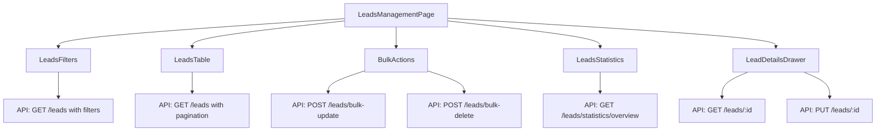

# Leads Management System

A comprehensive leads management system built with React and TypeScript, designed for department managers to efficiently manage and track leads.

## 🚀 Features

### 1. **Main Leads Table**
- **Paginated Table**: Fetches leads from `/leads?page=1&limit=20&status=open`
- **Columns**: Name, Email, Phone, Status, Type, Assigned To, Created At, Actions
- **Pagination Controls**: Next, Previous, Go to Page, Items per page
- **Sorting**: By creation date (newest first by default)
- **Selection**: Checkbox selection for bulk operations

### 2. **Advanced Filters & Search**
- **Search Box**: Real-time search by name, email, or phone
- **Status Filter**: New, In Progress, Contacted, Qualified, Proposal, Negotiation, Cracked, Completed, Failed, Closed Won/Lost
- **Type Filter**: Warm, Hot, Cold, Qualified, Unqualified, Push, Upsell
- **Sales Unit Filter**: Filter by sales unit assignment
- **Assigned To Filter**: Filter by assigned employee
- **Date Range Picker**: Filter by creation or close date
- **Clear Filters**: Reset all filters with one click

### 3. **Lead Details Drawer**
- **Contact Information**: Name, email, phone, source
- **Lead Status**: Current status and type with visual badges
- **Assignment Info**: Assigned to, sales unit, creation/update dates
- **Activity Timeline**: Status changes, assignments, comments history
- **Comments System**: Add, view, and manage lead comments
- **Inline Editing**: Edit lead details directly in the drawer

### 4. **Bulk Actions**
- **Multi-Select**: Select multiple leads with checkboxes
- **Bulk Assign**: Assign multiple leads to an employee
- **Bulk Status Change**: Update status for multiple leads
- **Bulk Delete**: Delete multiple leads with confirmation
- **Clear Selection**: Clear all selected leads

### 5. **Statistics Dashboard**
- **Overview Cards**: Total leads, conversion rate, monthly activity, active leads
- **Status Breakdown**: Visual breakdown of leads by status
- **Type Breakdown**: Visual breakdown of leads by type
- **Monthly Activity**: This month's new, in-progress, completed, failed leads
- **Conversion Funnel**: Visual representation of lead progression

## 📁 Component Structure

```
src/components/leads/
├── LeadsTable.tsx           # Main table with pagination
├── LeadsFilters.tsx         # Search and filter controls
├── LeadDetailsDrawer.tsx    # Lead details modal/drawer
├── BulkActions.tsx          # Bulk operations component
├── LeadsStatistics.tsx      # Statistics dashboard
├── index.ts                 # Component exports
└── README.md               # This documentation
```

## 🔧 API Integration

### Endpoints Used

1. **GET /leads** - Fetch leads with pagination and filters
   - Query params: `page`, `limit`, `search`, `status`, `type`, `salesUnitId`, `assignedTo`, `startDate`, `endDate`, `sortBy`, `sortOrder`

2. **GET /leads/:id** - Fetch individual lead details

3. **POST /leads** - Create new lead

4. **PUT /leads/:id** - Update lead

5. **DELETE /leads/:id** - Delete lead

6. **POST /leads/bulk-update** - Bulk update leads
   - Body: `{ leadIds: string[], updates: Partial<Lead> }`

7. **POST /leads/bulk-delete** - Bulk delete leads
   - Body: `{ leadIds: string[] }`

8. **GET /leads/statistics/overview** - Fetch lead statistics

9. **GET /employees** - Fetch employees for assignment

## 🎨 Styling

- **100% Tailwind CSS**: No separate CSS files
- **Responsive Design**: Mobile-first approach
- **Consistent UI**: Follows design system patterns
- **Accessibility**: ARIA labels and keyboard navigation
- **Loading States**: Skeleton loaders and spinners
- **Error States**: User-friendly error messages

## 📊 Data Flow



## 🚀 Usage

### Basic Implementation

```tsx
import LeadsManagementPage from './pages/Leads/LeadsManagementPage';

function App() {
  return <LeadsManagementPage />;
}
```

### Individual Components

```tsx
import { 
  LeadsTable, 
  LeadsFilters, 
  LeadDetailsDrawer,
  BulkActions,
  LeadsStatistics 
} from './components/leads';

// Use individual components as needed
```

## 🔧 Configuration

### Environment Variables

```env
VITE_API_BASE_URL=http://localhost:3000
```

### TypeScript Types

All types are defined in `src/types/index.ts`:

- `Lead` - Lead data structure
- `ApiResponse<T>` - API response wrapper
- `CreateLeadRequest` - Lead creation payload
- `LeadStatus`, `LeadType`, `LeadSource` - Enums

## 📱 Responsive Breakpoints

- **Mobile**: `< 768px` - Single column layout
- **Tablet**: `768px - 1024px` - Two column layout
- **Desktop**: `> 1024px` - Full multi-column layout

## 🎯 Key Features

### Performance Optimizations

- **Pagination**: Only loads 20 leads per page
- **Lazy Loading**: Statistics loaded on demand
- **Debounced Search**: Prevents excessive API calls
- **Optimistic Updates**: UI updates immediately for better UX

### User Experience

- **Real-time Feedback**: Success/error notifications
- **Loading States**: Clear loading indicators
- **Error Handling**: Graceful error recovery
- **Keyboard Navigation**: Full keyboard support
- **Accessibility**: Screen reader friendly

### Data Management

- **State Management**: React hooks for local state
- **API Integration**: Centralized API calls
- **Error Boundaries**: Graceful error handling
- **Type Safety**: Full TypeScript coverage

## 🔄 State Management

The main page manages the following state:

- `leads`: Array of lead objects
- `selectedLead`: Currently selected lead for details
- `selectedLeads`: Array of selected lead IDs for bulk operations
- `filters`: Current filter state
- `pagination`: Current page and total pages
- `statistics`: Lead statistics data
- `loading/error`: UI state management

## 🎨 Design System

### Color Palette

- **Primary**: Blue (600/700)
- **Success**: Green (500/600)
- **Warning**: Yellow (500/600)
- **Error**: Red (500/600)
- **Info**: Indigo (500/600)
- **Neutral**: Gray (50-900)

### Component Patterns

- **Cards**: White background with subtle shadows
- **Buttons**: Consistent sizing and hover states
- **Forms**: Clear labels and validation states
- **Tables**: Alternating row colors and hover effects
- **Modals**: Backdrop blur and smooth animations

## 🚀 Future Enhancements

- **Real-time Updates**: WebSocket integration
- **Advanced Analytics**: Charts and graphs
- **Export Functionality**: CSV/Excel export
- **Email Integration**: Send emails to leads
- **Calendar Integration**: Schedule follow-ups
- **Mobile App**: React Native version
- **Offline Support**: PWA capabilities

## 📝 Notes

- All components are fully typed with TypeScript
- No external UI library dependencies
- Pure Tailwind CSS styling
- Responsive and accessible design
- Production-ready code structure
